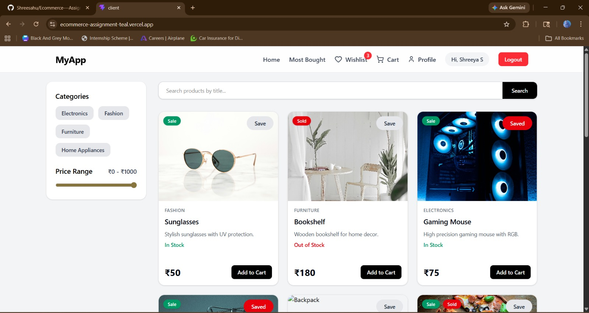
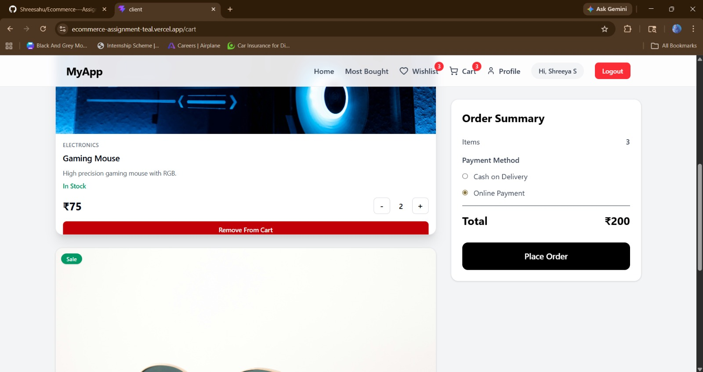
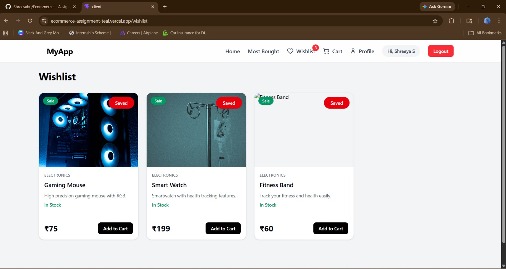
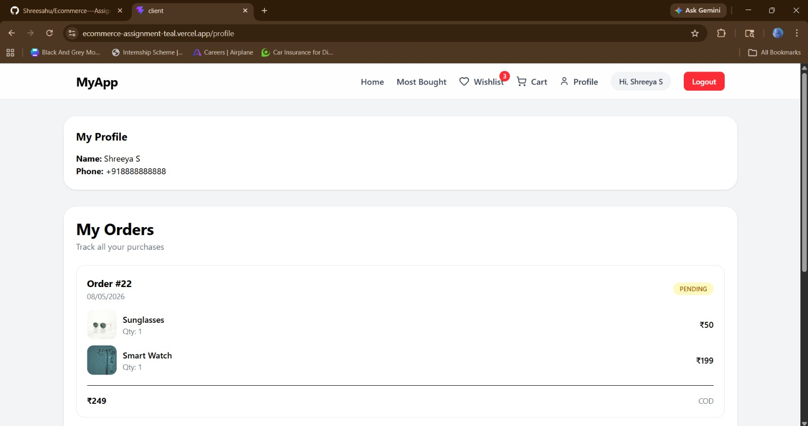
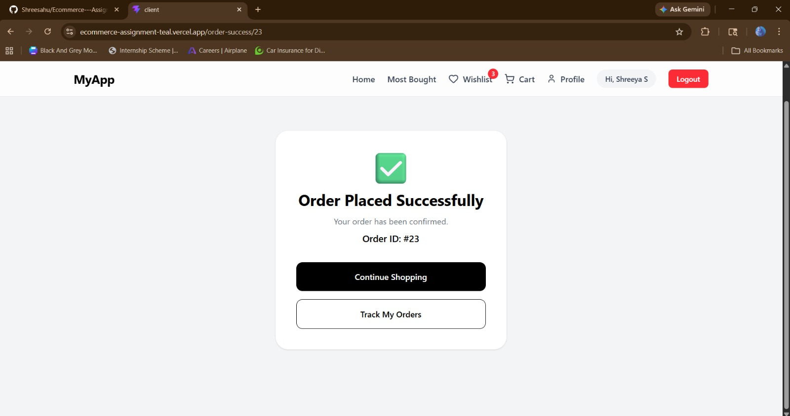

# E-Commerce Assignment Project

## Hosted Links

Frontend URL: 
```bash
https://ecommerce-assignment-teal.vercel.app

Backend Base URL:
```

```bash
https://ecommerce-assignment-sfbz.onrender.com
```

---

# About Project

This is a full stack E-Commerce web application project made using React in frontend and Node.js + Express in backend. PostgreSQL database is used with Prisma ORM for handling database related work.

Project contains features like Firebase OTP authentication, product browsing, searching, filtering, cart management, wishlist management, order creation, payment handling and order history tracking.

Frontend is deployed on Vercel and backend is deployed on Render.

---

## SCREENSHOTS

# Login


# SignUp


# Home


# Cart


# Wishlist


# profile


# Order Placed



---

# Technologies Used

## Frontend

- React.js
- Redux Toolkit
- React Router DOM
- Tailwind CSS
- Axios
- Firebase Authentication

## Backend

- Node.js
- Express.js
- PostgreSQL
- Prisma ORM
- JWT Authentication
- Firebase Admin SDK

## Deployment Details

- Frontend: Vercel
- Backend: Render
- Database: Neon PostgreSQL

---

# TO RUN LOCALLY FOLLOW THESE INSTRUCTIONS

# Frontend Setup

## Navigate to Client Folder

```bash
cd client
```

## Install Dependencies

```bash
npm install
```

## Create .env File

Create a `.env` file inside client folder and copy paste credentials sent via mail, content in .env look like this:

```env
VITE_BASE_URL=http://localhost:5000
VITE_FIREBASE_API_KEY=your_firebase_api_key
VITE_FIREBASE_AUTHDOMAIN=your_firebase_auth_domain
VITE_FIREBASE_PROJECTID=your_firebase_project_id
VITE_FIREBASE_STORAGEBUCKET=your_firebase_storage_bucket
VITE_FIREBASE_MESSAGINGSENDERID=your_firebase_messaging_sender_id
VITE_FIREBASE_APPID=your_firebase_app_id
VITE_FIREBASE_MEASUREMENTID=your_firebase_measurement_id

```

## Start Frontend

```bash
npm run dev
```

Frontend runs on:

```bash
http://localhost:5173
```

---

# Backend Setup

## Navigate to Backend Folder

```bash
cd backend
```

## Install Dependencies

```bash
npm install
```

## Create .env File

Create a `.env` file inside backend folder and copy paste credentials sent via mail, content in .env look like this:

```env
DATABASE_URL=your_postgresql_database_url
JWT_SECRET=your_jwt_secret
FIREBASE_PROJECT_ID=your_project_id
FIREBASE_PRIVATE_KEY=your_private_key
FIREBASE_CLIENT_EMAIL=your_client_email
ORIGIN=http://localhost:5173
PORT=5000
```

## Generate Prisma Client

```bash
npx prisma generate
```

## Push Prisma Schema

```bash
npx prisma db push
```

## Start Backend Server

```bash
npm start
```

Backend runs on:

```bash
http://localhost:5000
```

---

# Backend API Documentation

Base URL:

```bash
https://ecommerce-assignment-sfbz.onrender.com
```

---

# Authentication APIs

Base Route:

```bash
/api/auth
```

## Login User

### Endpoint

```bash
POST /api/auth/login
```

### Description

Used for login of existing user.

---

## Signup User

### Endpoint

```bash
POST /api/auth/signup
```

### Description

Used for creating new user account.

---

# Product APIs

Base Route:

```bash
/api/products
```

## Get All Products

### Endpoint

```bash
GET /api/products/get-all-product
```

### Description

Returns all products available in database.

---

## Get Product By ID

### Endpoint

```bash
GET /api/products/get-product/:id
```

### Description

Fetches details of a single product using product ID.

---

## Search Product By Title

### Endpoint

```bash
GET /api/products/search-product
```

### Query Parameters

```bash
?title=product_name
```

### Description

Searches products using product title.

---

## Filter Products

### Endpoint

```bash
GET /api/products/filter
```

### Description

Returns filtered products based on filters such as category or price.

---

## Most Bought Products

### Endpoint

```bash
GET /api/products/most-bought
```

### Description

Returns products with highest purchase frequency.

---

# Cart APIs

Base Route:

```bash
/api/cart
```

## Get User Cart

### Endpoint

```bash
GET /api/cart/items
```

### Description

Fetches all cart items of logged in user.

---

## Add Product To Cart

### Endpoint

```bash
POST /api/cart/items/add
```

### Description

Adds a product to user cart.

---

## Update Cart Item Quantity

### Endpoint

```bash
PATCH /api/cart/items/update
```

### Description

Increases or decreases quantity of a cart item.

---

## Remove Product From Cart

### Endpoint

```bash
DELETE /api/cart/items/remove
```

### Description

Removes a product from cart.

---

## Clear Entire Cart

### Endpoint

```bash
DELETE /api/cart/clear
```

### Description

Removes all items from cart.

---

# Wishlist APIs

Base Route:

```bash
/api/wishlist
```

## Get User Wishlist

### Endpoint

```bash
GET /api/wishlist/user
```

### Description

Fetches wishlist products of logged in user.

---

## Add Product To Wishlist

### Endpoint

```bash
POST /api/wishlist/add
```

### Description

Adds product to wishlist.

---

## Remove Product From Wishlist

### Endpoint

```bash
DELETE /api/wishlist/remove/:productId
```

### Description

Removes a product from wishlist.

---

# Order APIs

Base Route:

```bash
/api/orders
```

## Create Order

### Endpoint

```bash
POST /api/orders/add
```

### Description

Creates a new order.

---

## Get Order By ID

### Endpoint

```bash
GET /api/orders/get/:id
```

### Description

Fetches order details using order ID.

---

## Get All Orders

### Endpoint

```bash
GET /api/orders/all
```

### Description

Fetches all orders of logged in user.

---

## Cancel Order

### Endpoint

```bash
PATCH /api/orders/cancel/:id
```

### Description

Cancels an existing order.

---

# Payment APIs

Base Route:

```bash
/api/payment
```

## Complete Payment

### Endpoint

```bash
PATCH /api/payment/pay/:id
```

### Description

Marks payment as completed.

---

## Cancel Payment

### Endpoint

```bash
PATCH /api/payment/payment-cancel/:id
```

### Description

Cancels payment for an order.

---

# Features Added

- Firebase OTP Authentication
- JWT Based Authorization
- Product Listing
- Product Search with Debouncing
- Product Filtering
- Most Bought Products
- Cart Management
- Wishlist Management
- Order Management
- Payment Handling
- Redux State Management
- Protected Routes
- Infinite Product Loading
- Responsive UI
- Backend Deployment
- Frontend Deployment

---

# Deployment

## Frontend

Hosted on Vercel.

## Backend

Hosted on Render.

## Database

Hosted on Neon PostgreSQL.